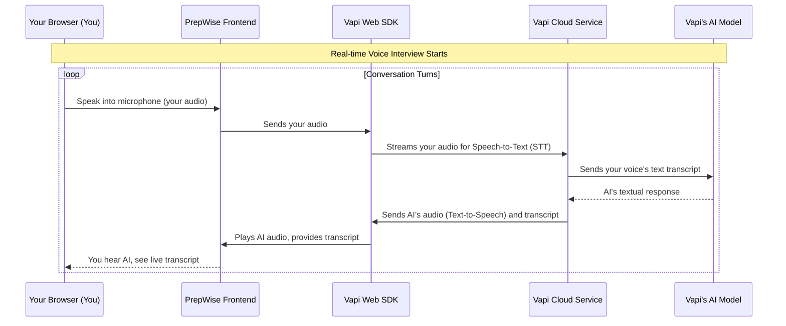
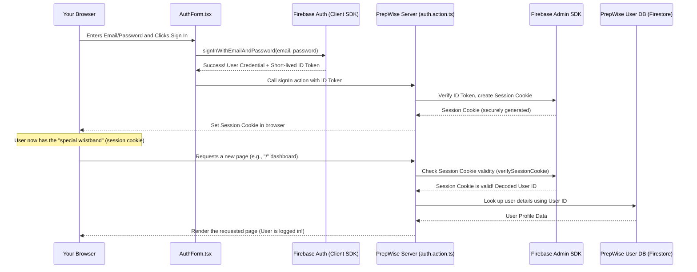

# ai_mock_interview_platform

🤖 Introduction
Built with Next.js for the user interface and backend logic, Firebase for authentication and data storage, styled with TailwindCSS and using Vapi's voice agents, Prepwise is a website project designed to help you learn integrating AI models with your apps. The platform offers a sleek and modern experience for job interview preparation.

If you're getting started and need assistance or face any bugs, join our active Discord community with over 50k+ members. It's a place where people help each other out.

Prepwise is an innovative platform designed to help users prepare for job interviews. It leverages **AI Voice Agents** from Vapi to conduct *real-time conversational mock interviews*. After the interview, it uses **Google Gemini** to *generate personalized feedback*, offering detailed insights into performance. All user data, interview details, and feedback reports are *securely stored* using **Firebase**, while a consistent and modern look is maintained through a system of **reusable UI components** and **Tailwind CSS styling**.

## Visual Overview

⚙️ Tech Stack
Next.js
Firebase
Tailwind CSS
Vapi AI
shadcn/ui
Google Gemeni
Zod
🔋 Features
👉 Authentication: Sign Up and Sign In using password/email authentication handled by Firebase.

👉 Create Interviews: Easily generate job interviews with help of Vapi voice assistants and Google Gemini.

👉 Get feedback from AI: Take the interview with AI voice agent, and receive instant feedback based on your conversation.

👉 Modern UI/UX: A sleek and user-friendly interface designed for a great experience.

👉 Interview Page: Conduct AI-driven interviews with real-time feedback and detailed transcripts.

👉 Dashboard: Manage and track all your interviews with easy navigation.

👉 Responsiveness: Fully responsive design that works seamlessly across devices.

and many more, including code architecture and reusability

### Under the Hood: The Real-time Voice Loop

Let's visualize the core process of how Vapi enables this real-time voice conversation:

#### 3. Client-Side vs. Server-Side

PrepWise uses both your web browser (client-side) and its own powerful servers (server-side) to handle authentication and sessions.

| Feature               | Client-Side (Your Browser)                                  | Server-Side (PrepWise Servers)                                       |
| :-------------------- | :---------------------------------------------------------- | :------------------------------------------------------------------- |
| **Role**              | Handles direct interaction with Firebase Authentication.    | Manages secure sessions, interacts with Firebase Admin SDK, database. |
| **Authentication**    | Sends email/password to Firebase.                           | Verifies Firebase ID Tokens, creates session cookies.                |
| **Session**           | Stores the session cookie securely.                         | Validates the session cookie to keep you logged in.                  |
| **Security Focus**    | Basic user interaction, gets temporary tokens.              | High-level security, permanent session management, database access.  |

Let's trace what happens when you sign in and then navigate to another page:

